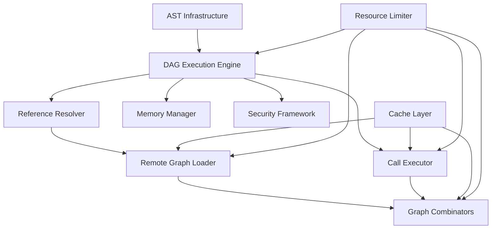

# Combined Critical Review: GFQL Programs Specification

## Executive Summary

This review synthesizes the analysis of five interconnected features proposed for GFQL Programs: DAG Composition, Dotted References, Remote Graph Loading, Graph Combinators, and Call Operations. Together, these features transform GFQL from a linear chain-based query language into a full-fledged graph programming environment. While each feature has individual merit, their true power and complexity emerge from their interactions.

## 1. Cross-Cutting Concerns

### 1.1 Reference Resolution Complexity

The reference resolution system underpins all features and presents several cross-cutting challenges:

- **Ambiguity in Nested Contexts**: DAG composition + dotted references + graph combinators create deeply nested scopes where reference resolution becomes complex
- **Performance Impact**: Every operation requires reference resolution, potentially creating a bottleneck
- **Error Propagation**: Reference errors in one part of a DAG can cascade unpredictably
- **Debugging Difficulty**: Users need clear visibility into how references resolve across nested scopes

### 1.2 Memory Management

All features contribute to memory pressure:

- **DAG Composition**: Multiple named graphs in memory simultaneously
- **Remote Graph Loading**: Large datasets loaded from external sources
- **Graph Combinators**: Intermediate results from union/intersection operations
- **Call Operations**: Transformations that may duplicate or expand data

The compound effect could easily exhaust available memory without careful management.

### 1.3 Security Surface Area

Each feature expands the attack surface:

- **Remote Graph**: External data access, authentication token management
- **Call Operations**: Arbitrary method execution, parameter injection risks
- **Graph Combinators**: Resource exhaustion through combinatorial explosion
- **DAG Composition**: Complex reference chains enabling data exfiltration

The intersection of these features creates novel attack vectors.

### 1.4 Type Safety and Validation

The dynamic nature of the system challenges type safety:

- **Schema Evolution**: Graphs loaded at different times may have incompatible schemas
- **Operation Compatibility**: Not all operations work on all graph types
- **Parameter Validation**: Call operations need runtime type checking
- **Result Predictability**: Complex DAGs make output types hard to predict

## 2. Integration Challenges

### 2.1 Feature Interdependencies

The features form a complex dependency graph:

```
DAG Composition (foundation)
├── Dotted References (enables nested access)
├── Remote Graph Loading (provides data sources)
│   └── Graph Combinators (operates on loaded graphs)
└── Call Operations (transforms any graph in DAG)
    └── Graph Combinators (uses call operations)
```

This creates circular dependencies that complicate implementation ordering.

### 2.2 Execution Model Conflicts

Different features assume different execution models:

- **DAG Composition**: Assumes parallel execution of independent branches
- **Call Operations**: Often require sequential execution with side effects
- **Remote Graph**: Asynchronous loading with unpredictable latency
- **Graph Combinators**: May benefit from lazy evaluation

Reconciling these models requires careful architectural decisions.

### 2.3 Error Handling Inconsistencies

Each feature has different error modes:

- **Remote Graph**: Network timeouts, authentication failures
- **Call Operations**: Invalid parameters, execution failures
- **Graph Combinators**: Schema mismatches, empty results
- **Reference Resolution**: Missing references, circular dependencies

A unified error handling strategy is essential but challenging.

### 2.4 Caching Strategy Conflicts

Different features benefit from different caching approaches:

- **Remote Graph**: Long-term caching of external data
- **DAG Results**: Short-term caching of intermediate results
- **Call Operations**: Method-specific caching policies
- **Reference Resolution**: Parse-time caching of resolved paths

## 3. Common Patterns and Design Principles

### 3.1 Emergent Patterns

Several patterns emerge across features:

1. **Lazy Evaluation**: Beneficial for DAGs, combinators, and remote loading
2. **Resource Limits**: Essential for all features to prevent abuse
3. **Validation Layers**: Every feature needs input validation
4. **Audit Logging**: Security and debugging require comprehensive logging
5. **Progressive Enhancement**: Features should gracefully degrade

### 3.2 Design Principles

The analysis reveals implicit design principles:

1. **Composability**: Features should combine predictably
2. **Fail-Fast**: Validate early, fail with clear errors
3. **Resource Awareness**: Every operation must consider resource impact
4. **Security by Default**: Restrictive defaults with explicit permissions
5. **Backward Compatibility**: New features cannot break existing usage

### 3.3 Architectural Patterns

Common architectural needs:

1. **Plugin Architecture**: Extensibility for call operations and combinators
2. **Strategy Pattern**: Different policies for merging, caching, execution
3. **Observer Pattern**: Monitoring and debugging hooks
4. **Factory Pattern**: Creating appropriate executors based on context

## 4. Security and Performance Implications

### 4.1 Compound Security Risks

Feature interactions create new vulnerabilities:

1. **Authentication Token Leakage**
   - Remote graphs pass tokens through DAG execution
   - Call operations might log sensitive parameters
   - Error messages could expose authentication details

2. **Cross-Tenant Data Mixing**
   - Graph combinators merge data from different sources
   - Shared execution context risks data leakage
   - Cache poisoning across tenant boundaries

3. **Denial of Service Amplification**
   - DAG + Remote Graph: Fetch loops exhausting bandwidth
   - Combinators + Call Operations: Exponential computation growth
   - Deep nesting: Stack overflow or memory exhaustion

### 4.2 Performance Multiplication Effects

Feature combinations can dramatically impact performance:

1. **Network Multiplication**
   - DAG with multiple remote graphs = multiple network calls
   - Reference resolution may require additional lookups
   - Retry policies amplify network traffic

2. **Memory Multiplication**
   - Each graph binding holds complete dataset
   - Combinators create intermediate results
   - Call operations may duplicate data

3. **Computation Multiplication**
   - Nested DAGs multiply execution paths
   - Graph combinators have quadratic complexity
   - Call operations on combined graphs amplify costs

## 5. Priority Recommendations

### 5.1 Implementation Priority Matrix

| Feature | Priority | Risk | Dependencies | Value |
|---------|----------|------|--------------|-------|
| Basic DAG + References | Critical | Medium | None | Foundation for all |
| Remote Graph (basic) | High | High | DAG | Enables key use cases |
| Call Operations (core) | High | Medium | DAG | Extends functionality |
| Graph Combinators | Medium | Low | DAG, Remote | Advanced workflows |
| Advanced Features | Low | High | All | Future extensibility |

### 5.2 Phased Rollout Strategy

**Phase 1: Foundation (Months 1-2)**
- Core DAG execution without nesting
- Simple reference resolution (no dots)
- Basic validation and error handling
- Memory management framework

**Phase 2: Remote Data (Months 2-3)**
- Remote graph loading with current auth
- Simple caching strategy
- Resource limits and timeouts
- Security audit

**Phase 3: Transformations (Months 3-4)**
- Core call operations with safelist
- Parameter validation framework
- Basic graph combinators
- Performance optimization

**Phase 4: Advanced Features (Months 4-6)**
- Nested DAGs with dotted references
- Advanced combinators with policies
- Extended call operations
- Production hardening

## 6. Risk Matrix

### 6.1 Technical Risks

| Risk | Probability | Impact | Mitigation |
|------|-------------|--------|------------|
| Memory exhaustion | High | Critical | Strict limits, monitoring |
| Reference ambiguity | Medium | High | Clear scoping rules, validation |
| Performance degradation | High | High | Caching, lazy evaluation |
| Security vulnerabilities | Medium | Critical | Audit, penetration testing |
| Breaking changes | Low | High | Careful API design, versioning |

### 6.2 Operational Risks

| Risk | Probability | Impact | Mitigation |
|------|-------------|--------|------------|
| Debugging complexity | High | Medium | Comprehensive logging, tools |
| User confusion | Medium | Medium | Clear documentation, examples |
| Support burden | High | Medium | Self-service debugging tools |
| Adoption friction | Medium | High | Gradual rollout, migration tools |

## 7. Implementation Dependencies

### 7.1 Technical Dependencies



### 7.2 Critical Path

1. **AST Extensions** (Week 1-2)
2. **Reference Resolution** (Week 2-3)
3. **DAG Execution** (Week 3-4)
4. **Memory Management** (Week 4-5)
5. **Security Framework** (Week 5-6)
6. **Feature Implementation** (Week 6+)

## 8. Overall Architecture Coherence Assessment

### 8.1 Strengths

1. **Conceptual Clarity**: Each feature has a clear purpose
2. **Composability**: Features combine naturally
3. **Extensibility**: Architecture supports future growth
4. **Backward Compatibility**: Existing code continues to work

### 8.2 Weaknesses

1. **Complexity Explosion**: Feature interactions create emergent complexity
2. **Resource Management**: No unified approach across features
3. **Error Handling**: Inconsistent patterns between features
4. **Performance Predictability**: Hard to estimate resource needs

### 8.3 Architectural Recommendations

1. **Unified Execution Context**
   ```python
   class ExecutionContext:
       memory_manager: MemoryManager
       reference_resolver: ReferenceResolver
       security_context: SecurityContext
       resource_limiter: ResourceLimiter
       cache_manager: CacheManager
   ```

2. **Layered Architecture**
   - Core AST and execution engine
   - Feature-specific executors
   - Cross-cutting concerns layer
   - Public API layer

3. **Plugin Architecture**
   - Extensible call operations
   - Custom graph combinators
   - External data sources
   - Custom policies

4. **Monitoring and Observability**
   - Execution tracing
   - Performance metrics
   - Resource usage tracking
   - Security audit logs

## Conclusion

The GFQL Programs specification represents a significant evolution of PyGraphistry's capabilities, transforming it from a visualization-focused tool to a comprehensive graph programming platform. While each individual feature is well-conceived, their integration presents substantial challenges in security, performance, and complexity management.

Success requires:
1. Careful phased implementation with continuous validation
2. Strong focus on cross-cutting concerns from the start
3. Comprehensive testing of feature interactions
4. Clear documentation and debugging tools
5. Conservative resource management
6. Security-first design approach

The potential value is significant, but the implementation complexity demands a methodical approach with careful attention to the system-level implications of these interconnected features.