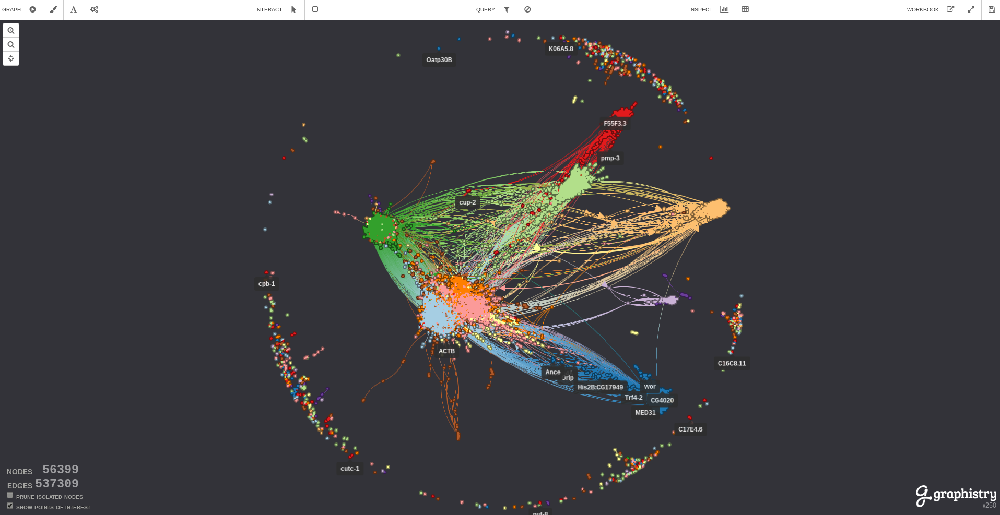
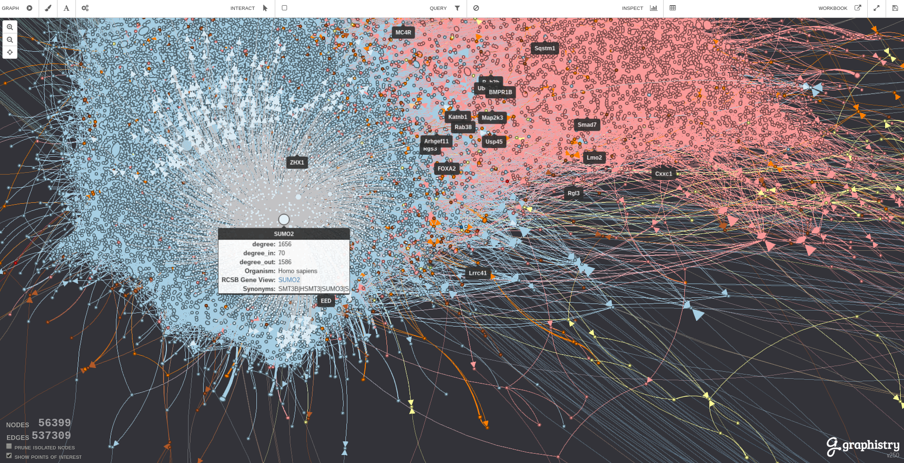
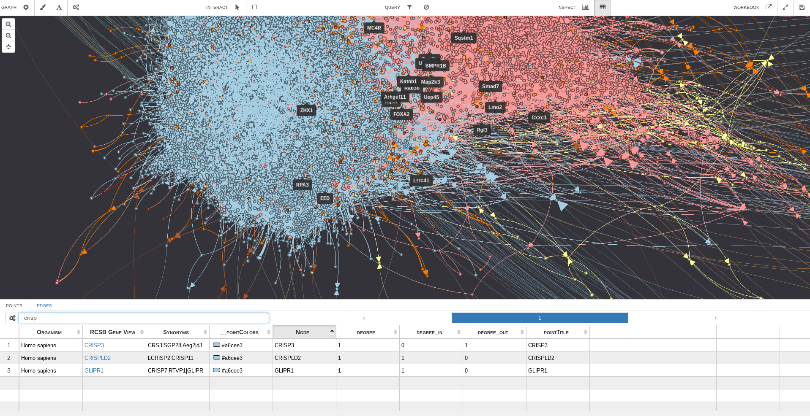
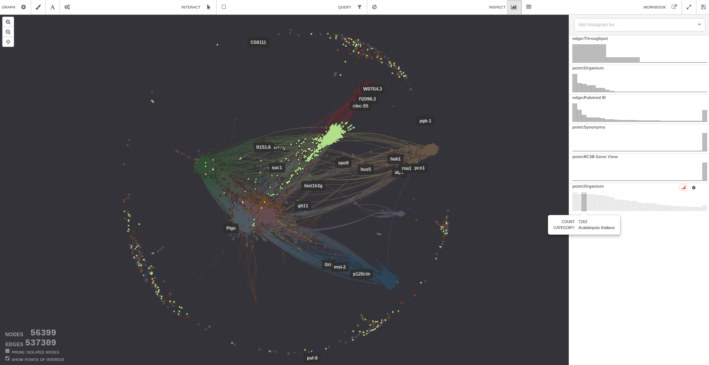

% Tooling to Containerize an OpenCL Visual Analytics Platform
% Lee Butterman, Graphistry, Inc.
% May 2017

# Welcome!

## Tooling to containerize an OpenCL Visual Analytics Platform
- We made our production deploys much easier
- We would like to share our tooling with you

## Real-time topological data analysis of huge graphs

## Real-time zoom in to see detail

## Inspection over all columns of data

## Scrub a histogram to see different clusters

## Overview
- What is OpenCL
- What is a container
- What is Docker and nvidia-docker
- What is an app in production
- What is current tooling
- What we have built
- How you can use it and help 😀

# Background!

## What is OpenCL
- multi-platform parallel computing paradigm
- runs on GPUs, _CPUs_, FPGAs, &c
- host vs device
- like CUDA, a general purpose language calls a driver to run kernels

## What is a container
- isolation, virtualization, limitation of system resources of a collection of processes
    - process ids, hostnames, user ids, networks, filesystems, etc
    - CPU, memory, disk i/o, network, etc
- talk directly to the Linux kernel APIs
- kernel exposes the Linux App Binary Interface, everything above that is up for grabs
    - including libc!
- a logical app gets wrapped up into a nice box 🎁
    - and the weirdness of language tooling is abstracted into boxes

## What is Docker + nvidia-docker
- "Docker" is an ecosystem around containers
    - Docker engine: CLI runtime to start/stop containers and apps therein
    - Docker hub: free & paid repositories of containers
    - Docker machine: provisioning
    - Docker compose: orchestration
    - and more!
- nvidia-docker helps run GPU-accelerated containers
    - nvidia-docker-plugin discovers pre-installed drivers and devices, hooks into volume mount requests
    - nvidia-docker is a CLI that uses the plugin to run containers with arbitrarily many GPUs
        - one-time cost at startup to attach things, Docker containers run as normal thereafter

## What is our idea of an app in production

- an app: mostly other people's code
    - lots of libraries for lots of non-GPU-oriented tech (S3, HTTP, JSON, BCrypt, ...)
- deploy environment may not be internet-accessible / may not access the internet
    - some customers have airgapped setups
- in production: under siege from The Internet
    - production is Serious Business
- the app's core competence is tough enough without using weird databases
- we are conservative and spend most of our effort on app dev, not ops

## What is our type of app in production

- Javascript is popular and okay
- People are optimizing its V8 runtime
- Server-side node.js + node-opencl = a clear optimization path
    - single-process map()
    - multi-process clusterMap()
    - CPU-mode kernel.run()
    - GPU-mode kernel.run() 🚀

## What is our app in production

- GPU-accelerated JS on client and server
    - WebGL on client, OpenCL on server
- Stateless visualization
- Front door with awareness of a cluster of processes
    - Viz session sticks to a process on a device with enough space
- Cluster membership
- Blob storage

## How is our app deployed

- multiple environments
    - SCIF, `us-east1`, some new cloud
        - (part of the excitement of a startup is customer development!)
- tooling is rapidly evolving
- simplifying assumption to treasure: 1 box can serve prod
    - sufficiently high availability on 1 machine in EC2
    - scale up 50x from a g2.2xl to a p2.16xl, punt on clustered deployment

## Conservative requirements

- Configure a machine to run containers and have any necessary drivers (automated, ideally)
- Verify that the machine is compatible with our stack
- Wrap up an artifact in development, ship it out
- Potentially reuse this artifact to run in development

# Things that have solved our problems

## Automated box setup

- Ansible script installs docker, nvidia drivers, nvidia-docker.
    - Ubuntu 16.04 LTS and RHEL 7.3
- Other ways to do it: docker-machine + manually run a few commands.
    - tooling is evolving fast in the past 18 months
- https://github.com/graphistry/infrastructure : nvidia-docker-host

## Validate that we can run node-opencl code

- cl.js convolution demo
- Exercises nvidia-docker, opencl driver loader, node opencl bindings
    - some machines do not have OpenCL support!
- Bonus: provides timings of CPU & GPU image convolutions
    - Extra bonus: there is a cute red panda
- https://github.com/graphistry/cljs / https://hub.docker.com/r/graphistry/cljs/

## Package an artifact

- Must be self-contained!
- Loadable versions of all containers used, in a .tar.gz
- OpenCL on CPU is a few hundred MB compressed; on GPU, almost 1GB compressed
    - This is not a nimble 10MB image based on Alpine Linux
- `docker-gc` becomes more important
- `tar` + `pigz`, and a homemade orchestration bash script
    - this was not unreasonable a year and a half ago

## Run containers in dev

- Provides a quick-start guide to run the app
- Until the year of Linux on the desktop 🙏 Docker is in a VM and cannot connect to the GPU
- In production we only need 60 fps; small jobs on the CPU?
    - we have this luxury, versus large batch jobs (eg radiological deep learning)
- Cloud dev environments with or without GPU
- dockerhub: graphistry/node-opencl-{gpu,cpu}

# This is only the begining!

## Further directions

- more configurations! (FPGA devices! ARM hosts! Power8‽)
- tighter integration with Docker?
- Kubernetes!
- smaller images!

## Thank you!

### Lee Butterman, lsb@graphistry.com

#### Questions? Comments? Discussions?

