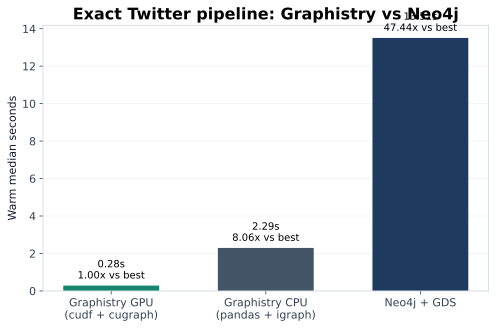
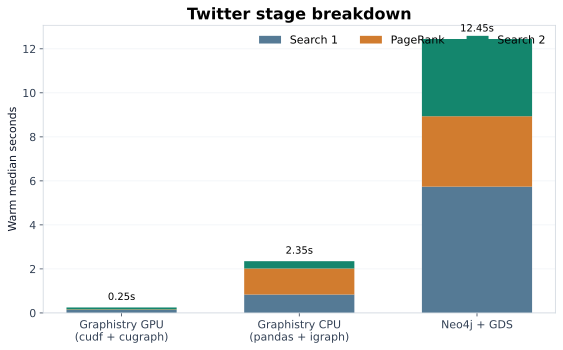
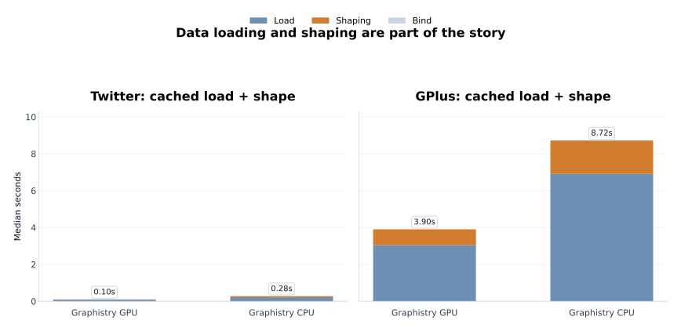

End-to-End GFQL Benchmark: Dataframes, Search, Analytics, No Database
======================================================================

This benchmark is meant to answer a simple question:

**If your graph already lives in Python dataframes, how much of a real graph pipeline can you run there directly, and how fast is it on CPU vs GPU?**

The answer here is unusually strong because the benchmark is not just one graph algorithm in isolation. It is an end-to-end workflow that stays in open-source Python tooling:

- load a large graph from a cached edge list
- shape node metadata in a dataframe
- run graph search / subgraph extraction with GFQL
- run PageRank on the selected graph
- keep the resulting graph for downstream analysis or visualization

Benchmark environment
---------------------

- Host: ``dgx-spark``
- GPU: ``GB10``
- NVIDIA driver: ``580.126.09``
- Container/runtime: ``graphistry/test-gpu:latest``
- Presentation mode: this page renders only saved JSON outputs under ``plans/gfql-gpu-pagerank-benchmark/results/`` and does **not** rerun the benchmarks

Why this matters
----------------

- **GFQL** is Graphistry's dataframe-native graph query language.
- It executes directly on Python dataframes and graph objects instead of requiring an external graph database.
- The same workflow can run on:
  - **CPU** with ``pandas + igraph``
  - **GPU** with ``cudf + cugraph``
- The benchmark also includes a **Neo4j + GDS** comparison where we can make an honest apples-to-apples comparison.

This means the benchmark is testing a practical claim, not just a microbenchmark:

**Can you get database-style graph search + graph analytics directly on your dataframe, and does the GPU path materially change the answer?**

What is being benchmarked
-------------------------

The pipeline is intentionally simple and representative:

1. **Data loading**
   Read a cached SNAP edge list into a dataframe.
2. **Data shaping**
   Compute degree, build seed flags, and materialize node metadata.
3. **Graph search**
   Use GFQL to expand around interesting nodes and extract a subgraph.
4. **Graph analytics**
   Run PageRank on the resulting graph.
5. **Graph search again**
   Keep the high-PageRank core and its local neighborhood.
6. **Downstream use**
   Keep the final graph directly in Python for follow-on analysis or visualization.

The important detail is that these are not separate systems stitched together. The Graphistry CPU and GPU paths both keep the workflow dataframe-native, and the GPU path accelerates both the dataframe work and the graph algorithm work.

Exact 3-way comparison on Twitter
---------------------------------

The Twitter-sized run is the cleanest exact apples-to-apples comparison because all three systems finish comfortably.

Takeaways:

- Graphistry GPU: ``0.31s``
- Graphistry CPU: ``2.32s``
- Neo4j + GDS: ``13.51s``
- Graphistry GPU is the fastest end-to-end path.
- Graphistry CPU is still materially faster than Neo4j for the same Twitter workload.
- The PageRank step shows the strongest backend acceleration, but the search/filter stages matter too.

Data loading and shaping are part of the story
----------------------------------------------

This benchmark is not pretending that ingest and dataframe preparation are free.
We measure cached local file -> in-memory graph preparation separately from the warm search/analytics pipeline.

Takeaways:

- Twitter cached load + shape: CPU ``0.28s`` vs GPU ``0.10s``
- GPlus cached load + shape: CPU ``8.72s`` vs GPU ``3.93s``
- ``cudf`` is faster not only for the graph pipeline but also for cached ingest/shaping.
- That matters because the benchmark story is about an end-to-end graph workflow, not just a single kernel.
- We intentionally kept these numbers honest and did **not** switch to a risky dtype optimization that overflowed on GPlus in pandas.

Larger-graph story on GPlus
---------------------------

The GPlus run is where the CPU-vs-GPU story becomes especially compelling. It is also where Neo4j becomes expensive enough that the honest result is a lower bound instead of a polished exact number.

.. image:: _static/filter_pagerank/gplus_lifecycle.svg
   :alt: GPlus lifecycle comparison with Graphistry CPU, Graphistry GPU, and a Neo4j lower bound

Takeaways:

- Graphistry GPU total lifecycle on GPlus: about ``8.01s`` (``3.93s`` load/shape + ``4.08s`` warm pipeline)
- Graphistry CPU total lifecycle on GPlus: about ``91.20s`` (``8.72s`` load/shape + ``82.48s`` warm pipeline)
- Neo4j is shown honestly as a lower bound here: it exceeded ``3m07s`` before the main transaction even finished closing.
- On GPlus, the Graphistry GPU path reduces a minute-scale CPU pipeline to a few seconds.
- The big win is not just one algorithm; it is the combination of dataframe-native loading/shaping, graph search, and graph analytics.

Why the CPU and GPU versions are both interesting
-------------------------------------------------

This benchmark is interesting even before the GPU enters the picture.
The CPU path already shows that you can run a real graph-search + PageRank workflow directly on your dataframe without standing up a graph database.

The GPU path matters because it keeps the same general workflow while accelerating:

- the dataframe-native parts
- the graph-search parts
- the graph-analytics parts

That is why the story is stronger than "GPU PageRank is faster":

**the whole open-source Python graph pipeline is faster, while staying local to your dataframes.**

Notebook version
----------------

For a notebook-oriented version of this writeup, see:

- ``demos/gfql/benchmark_filter_pagerank_cpu_gpu.ipynb``

That notebook is presentation-first and uses the same saved DGX result files used by this page. It does not rerun the benchmarks.
