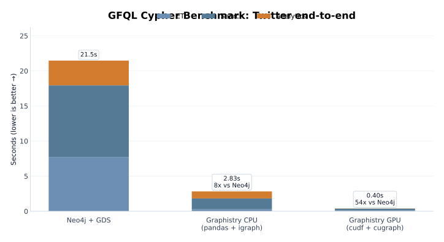
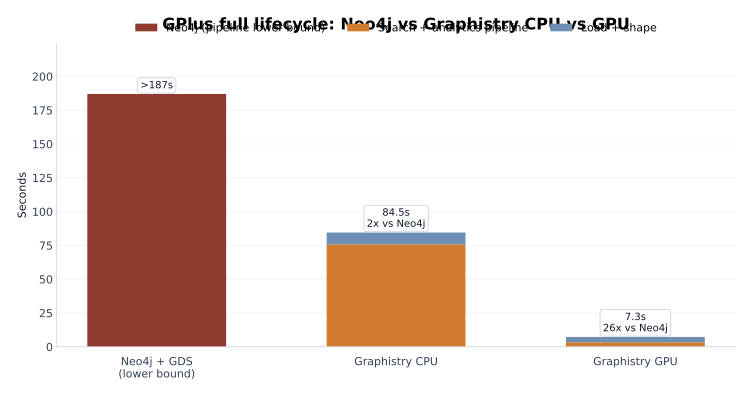

GFQL Cypher Benchmark: Local Cypher on DataFrames vs Neo4j
==========================================================

Run Cypher graph queries and analytics directly on Python dataframes —
no database required. This benchmark compares **Graphistry's local Cypher**
(CPU and GPU) against **Neo4j + GDS** on the same end-to-end pipeline.

.. list-table::
   :header-rows: 1
   :widths: 30 20 20 20 20

   * -
     - Neo4j + GDS
     - GFQL Cypher (CPU)
     - GFQL Cypher (GPU)
     - GPU speedup vs Neo4j
   * - **Twitter** (2.4M edges)
     - 13.83s
     - 2.55s
     - **0.30s**
     - **46x**
   * - **GPlus** (30M edges)
     - >187s
     - 75.78s
     - **3.33s**
     - **>56x**

*Warm median of 5 runs, 2 warmup iterations. DGX dgx-spark, GB10 GPU.*

The pipeline
------------

One ``g.gfql(...)`` call — search, enrich with PageRank, search again:

.. code-block:: python

   result = g.gfql(
       "GRAPH g1 = GRAPH { "
       "  MATCH (n)-[e]-(m) "
       "  WHERE n.degree >= $degree_cutoff "
       "} "
       "GRAPH g2 = GRAPH { "
       "  USE g1 "
       f"  CALL graphistry.{backend}.pagerank.write() "
       "} "
       "GRAPH { "
       "  USE g2 "
       "  MATCH (n)-[e]-(m) "
       "  WHERE n.pagerank >= $pagerank_cutoff "
       "}",
       params={
           "degree_cutoff": degree_cutoff,
           "pagerank_cutoff": pagerank_cutoff,
       },
       engine=engine,  # "pandas" for CPU, "cudf" for GPU
   )

- ``GRAPH g1``: find high-degree nodes and their neighbors
- ``GRAPH g2``: enrich ``g1`` with PageRank scores (igraph on CPU, cugraph on GPU)
- Final ``GRAPH``: keep high-PageRank nodes and their neighbors

The same pipeline shape, different backends:

- **CPU**: ``engine="pandas"``, ``backend="igraph"``
- **GPU**: ``engine="cudf"``, ``backend="cugraph"``

The Neo4j equivalent requires ~30 lines of Cypher + GDS projection + batched
writes (see :ref:`neo4j-analog` below).

Twitter: exact 3-way comparison
--------------------------------

Stacked by workload phase: **ETL** (load + shape), **Search** (graph queries), **Analytics** (PageRank).

- Neo4j total lifecycle: ~21.6s (6.0s import + 1.7s prep + 13.8s pipeline)
- GFQL Cypher CPU: ~2.8s — **8x faster than Neo4j**
- GFQL Cypher GPU: ~0.4s — **54x faster than Neo4j**

GPlus: larger graph
--------------------

- Neo4j: **>187s** (lower bound — the transaction did not finish)
- GFQL Cypher CPU: ~85.5s — still faster than Neo4j's incomplete run
- GFQL Cypher GPU: ~7.1s — **>26x faster than Neo4j**

Why this matters
----------------

The CPU path already beats Neo4j without a GPU. You get Cypher-style graph
search + PageRank directly on your dataframe, no database to stand up or
maintain.

The GPU path accelerates everything — ETL, search, and analytics — because
``cudf`` and ``cugraph`` are drop-in replacements for ``pandas`` and ``igraph``
under the same GFQL Cypher surface.

.. _neo4j-analog:

Neo4j + GDS analog
-------------------

The Neo4j equivalent of the same pipeline:

.. code-block:: cypher

   -- 1. Mark seed nodes by degree
   MATCH (n:Node)
   SET n.seed = n.degree >= $cutoff;

   -- 2. Expand one hop from seeds
   UNWIND $seed_ids AS sid
   MATCH (s:Node) WHERE id(s) = sid
   MATCH (s)-[r:LINK]-(target:Node)
   SET target.in_subgraph = true, r.in_subgraph = true;

   -- 3. Project subgraph and run PageRank
   CALL gds.graph.project.cypher(
     'subgraph',
     'MATCH (n:Node) WHERE n.in_subgraph RETURN id(n) AS id',
     'MATCH (a)-[r:LINK]->(b) WHERE r.in_subgraph
      RETURN id(a) AS source, id(b) AS target
      UNION ALL
      MATCH (a)-[r:LINK]->(b) WHERE r.in_subgraph
      RETURN id(b) AS source, id(a) AS target'
   );
   CALL gds.pageRank.write('subgraph', {writeProperty: 'pagerank'});

   -- 4. Keep high-PageRank core + one hop
   MATCH (n:Node) WHERE n.pagerank >= $cutoff
   SET n.core = true;
   UNWIND $core_ids AS cid
   MATCH (c:Node) WHERE id(c) = cid
   MATCH (c)-[r:LINK]-(target:Node)
   SET target.final = true, r.final = true;

Benchmark environment
---------------------

- Host: ``dgx-spark``, GPU: ``GB10``, driver ``580.126.09``
- Container: ``graphistry/test-gpu:latest``
- Datasets: `SNAP <https://snap.stanford.edu/data/>`_ Twitter (2.4M edges) and GPlus (30M edges)
- Measurement: median of 5 runs after 2 warmup iterations
- Results rendered from saved JSON — this page does **not** rerun benchmarks

Notebook version
----------------

See ``demos/gfql/benchmark_filter_pagerank_cpu_gpu.ipynb`` for a notebook
version of this writeup using the same saved DGX results.
